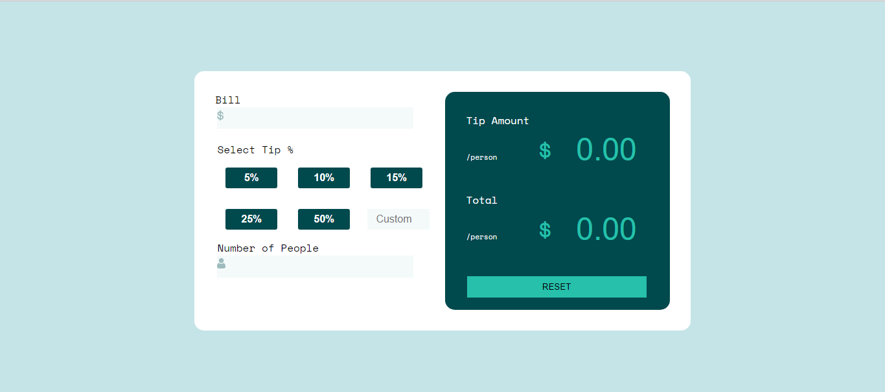

# Frontend Mentor - Tip calculator app solution

This is a solution to the [Tip calculator app challenge on Frontend Mentor](https://www.frontendmentor.io/challenges/tip-calculator-app-ugJNGbJUX). Frontend Mentor challenges help you improve your coding skills by building realistic projects.

## Table of contents

- [Overview](#overview)
  - [The challenge](#the-challenge)
  - [Screenshot](#screenshot)
  - [Links](#links)
- [My process](#my-process)
  - [Built with](#built-with)
  - [What I learned](#what-i-learned)
  - [Continued development](#continued-development)
  - [Useful resources](#useful-resources)
- [Author](#author)
- [Acknowledgments](#acknowledgments)


## Overview
To design a Tip calculator

### The challenge

Users should be able to:

- View the optimal layout for the app depending on their device's screen size
- See hover states for all interactive elements on the page
- Calculate the correct tip and total cost of the bill per person

### Screenshot




### Links

- Solution URL: [Add solution URL here](https://your-solution-url.com)
- Live Site URL: [Add live site URL here](https://your-live-site-url.com)

## My process
I did the Html markup first then stle for desktop with css, I the added interactions with Javascript and lastly syle for mobile with media queries

### Built with

- Semantic HTML5 markup
- CSS custom properties
- Flexbox
- CSS Grid
- web-first workflow


### What I learned

improved my CSS and Javascript skills


```html
<span class="dollarsign">&#36;</span><input type="number" class="tipInput"  value="0.00"  disabled>
```
```css
.dollar-input {
    display: inline-flex;
    align-items: center;
    /* border: 1px solid #ccc;
    border-radius: 4px; */
    padding: 4px;
  }
```
```js
if(secondInput.value==0 || secondInput.value==null){
         errorparagraph.style.visibility='visible'
         secondInput.style.border='1px solid red'
         setTimeout(RemoveError, 5000)
         tipInput.value=0.00.toFixed(2)
         tipAmount.value=0.00.toFixed(2)
         
        
      }
```


### Continued development

i would continue improving my JS skills on DSA, APIs, Object, react.


### Useful resources

- [Example resource 1](w3 school) - This helped me for research reason. I really liked this pattern and will use it going forward.
- [Example resource 2](https://www.javapoint.com) - This is an amazing article which helped me finally understand more concept on JS. I'd recommend it to anyone still learning this concept on DOM.


## Author

- Website - [Stephen George](https://github.com/El-charis)
- Frontend Mentor - [@yourusername](https://www.frontendmentor.io/profile/El-charis)
- Twitter - [@yourusername](https://twitter.com/callme_george_)


## Acknowledgments

Thanks to Google and myself🤣


